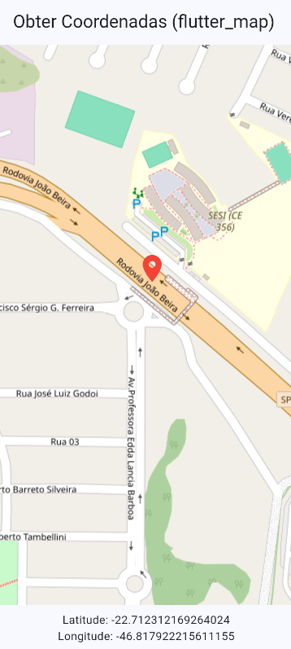

# Flutter Map — Obter Coordenadas

## O que o aplicativo faz

* Exibe um mapa.
* Ao clicar em um ponto do mapa, captura latitude e longitude.
* Mostra as coordenadas em um SnackBar, no console e na parte inferior da tela.
* Coloca um marcador vermelho no ponto clicado.

## Tecnologias Utilizadas
- Flutter
- Dart
- flutter_map
- latlong2
- OpenStreetMap
- Visual Studio Code

## Como executar

### 1. Clonar o repositório

Clone o repositório para sua máquina local.

### 2. Abrir o projeto

Abra esta pasta no VS Code e abra o terminal.

### 2. Baixar as dependências

```bash
flutter pub get
```

### 3. Executar 

```bash
flutter run
```

Clique no mapa. A latitude e longitude devem aparecer na parte inferior e em uma mensagem na tela, e um marcador vermelho será colocado no ponto.

## 4. Print do app



## 5. APK

[Clique para baixar o APK](assets/app-release.apk)
